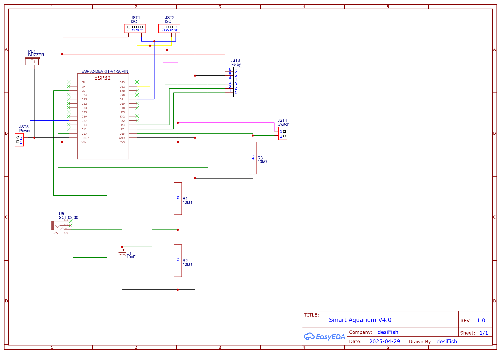

# Project_Mina 🐠
[]()
[]()
[]()
[]()

> In Sanskrit, "Mina" (मीन) represents the fish, symbolizing freedom, fluidity, and the eternal flow of life. As the twelfth and final sign of the zodiac (known as "Pisces" in Western astrology), Mina embodies adaptability and spiritual wisdom. Just as fish navigate the depths with graceful purpose, this project aims to create harmony between technology and aquatic life. The name embodies our philosophy of maintaining balance in the artificial ecosystems we create, guided by ancient wisdom yet powered by modern innovation.

[](https://github.com/desiFish/Project_Mina/stargazers)
[](https://github.com/desiFish/Project_Mina/network)
[](https://github.com/desiFish/Project_Mina/issues)
[](https://github.com/desiFish/Project_Mina/blob/main/LICENSE)
[](https://github.com/desiFish/Project_Mina/commits/main)
[](https://github.com/desiFish/Project_Mina)
[](https://github.com/desiFish/Project_Mina)
[](https://github.com/desiFish/Project_Mina)

## ⚠️ SAFETY WARNING ⚡

**DANGER: This project involves HIGH VOLTAGE (240V AC) which can be LETHAL!**

This project interfaces with mains electricity which poses serious risks including:
- ⚡ Electric shock
- 🔥 Fire hazard
- 💧 Water + electricity dangers

### Required Safety Measures:
1. **Circuit Protection:**
   - Install appropriate MCB (Miniature Circuit Breaker)
   - Use RCCB (Residual Current Circuit Breaker) rated 30mA
   - Proper fusing for each circuit (max 6A)

2. **Grounding:**
   - All metal parts must be properly grounded
   - Use ground fault protection
   - Double-check ground connections

3. **Installation:**
   - Must be installed by qualified electrician
   - Follow local electrical codes
   - Use proper junction boxes
   - Keep high voltage components away from water

4. **Operation:**
   - Never operate with wet hands
   - Keep electronics sealed from moisture
   - Regular safety inspections
   - Disconnect power before maintenance

**DISCLAIMER:** Author (desiFish) is not responsible for any damage or injury. Proceed at your own risk.

## 🌊 Coming Soon! 
_Project under development_ 🛠️

⚠️ **IMPORTANT**: This project is in active development and has not been thoroughly tested. Use at your own risk.

A cutting-edge aquarium control system that will revolutionize your underwater world! 🎮 
Advanced control for aquariums using ESP32, Preference Lib. and LittleFS.

### Upcoming Features:
- ~~📟 20x4 LCD Display for on-device status~~
  ~~- Real-time relay status~~
  ~~- Current time and schedules~~
  ~~- Basic system information~~
  ~~- No WiFi required for essential monitoring~~

> Note: Since this version is using webserver, I am putting away the LCD option, since all controls are available in web server. Rather I will use 4 WS2812B RGB LEDs for simple status purpose.
> The LCD version along with buttons will feature in Smart Aquarium V4.1

- 💡 4x WS2812B RGB LEDs for status indication
  - Visual relay status indication
  - Network connection status
  - System status alerts
  - Error condition warnings

### Current Features:
- 🤜 Better Web UI
- 📱 Mobile-friendly interface
- 📊 Automatic Controls
- ⚡ Dual-core ESP32 support only (ESP32, ESP32-WROOM, etc.)

### Technical Details:
- 💾 Uses LittleFS for storing web interface files
- 💽 Preferences library for persistent settings storage
- 🕒 Real-time scheduling with DS3231 RTC
- 🌐 NTP time synchronization
- 🔌 Controls up to 4 independent relays (easily scalable)
- 🎛️ Three operating modes per relay
- 💡 State persistence across power cycles
- 📱 Mobile-first responsive interface
- ⚡ Runs on both CPU cores for reliability
- 🔄 Automatic status updates every second
- 🌍 Async web server for better performance
- 📊 JSON-based API endpoints

### Scalability Note:
- ✨ Backend code is fully scalable - just modify NUM_RELAYS and RELAY_PINS array
- 🔧 Web UI JavaScript is scalable - all functions work with any relay ID
- ⚠️ HTML components need manual duplication with correct ID numbers for additional relays
- 📍 Default pin configuration: GPIO 26, 27, 14, 12
- 🔧 Max relay count limited only by available GPIO pins

## 📱 Operating Modes

Project_Mina offers three versatile operating modes for each relay:

### 🔄 Manual Mode
Default operating mode for all relays.
1. Toggle relay ON/OFF directly through the web interface
2. State persists until manually changed
3. Ideal for direct control of equipment
4. Settings are saved and restored after power cycles

### ⏱️ Timer Mode
Temporary timed operation for specific durations.
1. Set desired duration in seconds
2. Relay automatically toggles after duration expires
3. Returns to manual mode after completion
4. Perfect for temporary operations (feeding, maintenance)
5. Timer state persists through power cycles

### 🕒 Auto Mode
Scheduled operation based on time of day.
1. Set ON time and OFF time (24-hour format, e.g., "14:30")
2. Supports both same-day schedules (ON: 09:00, OFF: 17:00)
3. Handles overnight schedules (ON: 22:00, OFF: 06:00)
4. Checks schedule every second
5. Schedule persists through power cycles

> 💡 **Tip**: For equipment that needs to run overnight, set the ON time after the OFF time
> (e.g., ON: 22:00, OFF: 06:00)

## 🤝 Sharing & Contributing

### 🌟 Show Your Support
If you find this project useful, consider:
- ⭐ Giving it a star on GitHub
- 🔄 Forking it for your own projects
- 📢 Sharing it with fellow aquarium enthusiasts

### 🎯 How to Fork & Use
1. 🔱 Click the "Fork" button at the top right
2. 📋 Clone your fork: `git clone https://github.com/YOUR_USERNAME/Project_Mina.git`
3. 🔨 Make your changes
4. 💝 Share your improvements through Pull Requests

### 🙏 Giving Credit
When using this project, please:
- 🔗 Link back to the original repository
- 📝 Keep the GPL-3.0 license intact
- 🌈 Mention in your README: "Based on [Project_Mina](https://github.com/desiFish/Project_Mina) by desiFish"

### 💫 Spread the Word
- 🐦 Share on Twitter/X
- 📱 Post on aquarium forums
- 👥 Tell your fish-keeping friends

## 📱 Preview

<table>
<tr>
    <td align="center" width="50%">
        
        <br>Main Control
    </td>
    <td align="center" width="50%">
        
        <br>Settings
    </td>
</tr>
<tr>
    <td align="center" colspan="2">
        
        <br>New Interface
    </td>
</tr>
<tr>
    <td align="center" colspan="2">
        
        <br>Tentative Circuit Schematic V4.0
    </td>
</tr>
</table>

Stay tuned for more updates! 🚀

## 📦 Installation

### Prerequisites
1. Install [Arduino IDE 2.3.6](https://www.arduino.cc/en/software) or newer
2. Install ESP32 board package:
   - Add `https://raw.githubusercontent.com/espressif/arduino-esp32/gh-pages/package_esp32_index.json` to Additional Board URLs
   - Install "ESP32 by Espressif Systems" from Boards Manager

> ⚠️ **Hardware Compatibility**: Currently tested only on ESP32 DevKit V1 (30-pin version). Other ESP32 boards may work but are untested.

### Required Libraries
Install these from Arduino Library Manager:
- [ESPAsyncWebServer](https://github.com/ESP32Async/ESPAsyncWebServer) - Async HTTP and WebSocket server
- [AsyncTCP](https://github.com/ESP32Async/AsyncTCP) - Required by ESPAsyncWebServer
- [RTClib](https://github.com/adafruit/RTClib) - RTC support by Adafruit
- ArduinoJson
- NTPClient
- Preferences (built-in)
- WiFi (built-in)

### Board Configuration
1. Select Board: ESP32 Dev Module
2. Upload Speed: 921600
3. CPU Frequency: 240MHz
4. Flash Frequency: 80MHz
5. Flash Mode: QIO
6. Flash Size: 4MB (32Mb)
7. Partition Scheme: Default 4MB with spiffs

### LittleFS Setup
See **Resources** section for LittleFS installation guide.

### Project Setup
1. Clone repository:
   ```bash
   git clone https://github.com/desiFish/Project_Mina.git
   ```
2. Open `Project_Mina.ino` in Arduino IDE
3. Edit WiFi credentials in code:
   ```cpp
   const char* ssid = "YOUR_WIFI_SSID";
   const char* password = "YOUR_WIFI_PASSWORD";
   ```
4. Connect ESP32 via USB
5. Select correct COM port in Tools menu
6. Upload sketch (▶️ button)
7. Upload web interface:
   - Press `Ctrl + Shift + P`
   - Type "littlefs" and select "Upload LittleFS image to Pico/ESP8266/ESP32"
   - Wait for "LittleFS image uploaded" message
   
   > If you encounter any errors:
   > - Close Serial Monitor
   > - Restart Arduino IDE
   > - See Resources section for detailed troubleshooting

### Hardware Setup
⚠️ **Remember safety warnings - work with mains voltage is dangerous!**
1. Connect DS3231 RTC:
   - SDA → GPIO 21
   - SCL → GPIO 22
   - VCC → 3.3V
   - GND → GND
2. Connect relays to specified pins:
   - Relay 1 → GPIO 26
   - Relay 2 → GPIO 27
   - Relay 3 → GPIO 14
   - Relay 4 → GPIO 12

### First Run
1. Power up the device
2. Connect to your WiFi network
3. Find ESP32's IP address in Serial Monitor
4. Access web interface: `http://<ESP32-IP-ADDRESS>`
5. Update RTC time using the Settings page

### 📚 Resources
- 📥 [Installing LittleFS Uploader in Arduino IDE 2](https://randomnerdtutorials.com/arduino-ide-2-install-esp32-littlefs/)
  Essential for uploading the web interface files to ESP32

## 📜 License

This project is licensed under the GNU General Public License v3.0 (GPL-3.0):

### What you can do:
- ✅ Commercial use
- ✅ Modify and distribute
- ✅ Patent use
- ✅ Private use

### What you must do:
- 📢 Disclose source
- 📝 License and copyright notice
- 📋 State changes
- 🔄 Same license

### What you cannot do:
- ❌ Hold liable
- ❌ Sublicense
- ❌ Remove copyleft

See [LICENSE](LICENSE) for the full license text.

---

Made with ❤️ in India

> I love Open Source! This project is my way of giving back to the amazing developer community that taught me everything I know.
> Happy coding! 🇮🇳