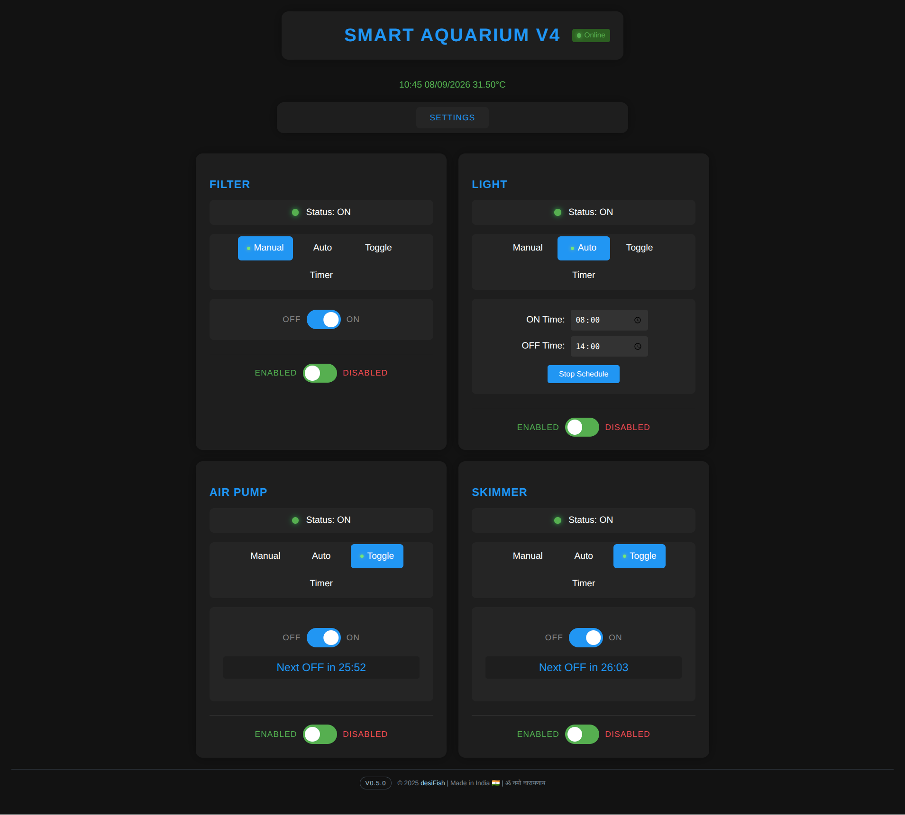
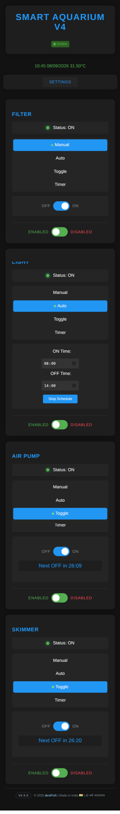
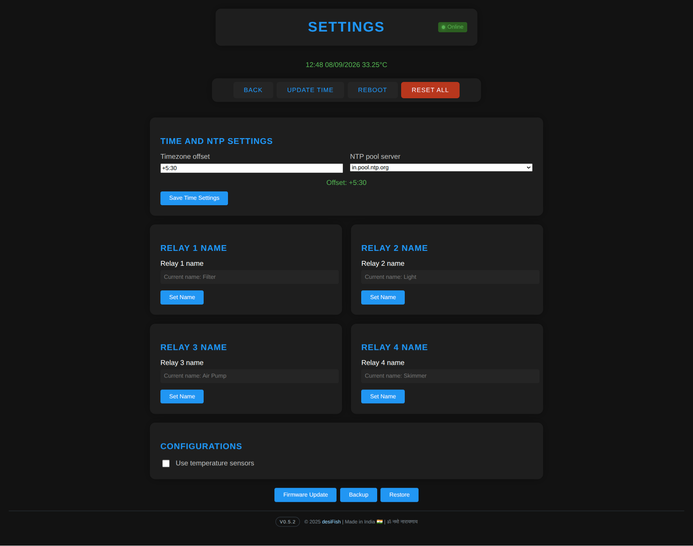
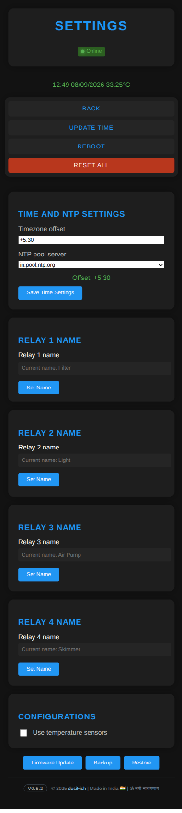
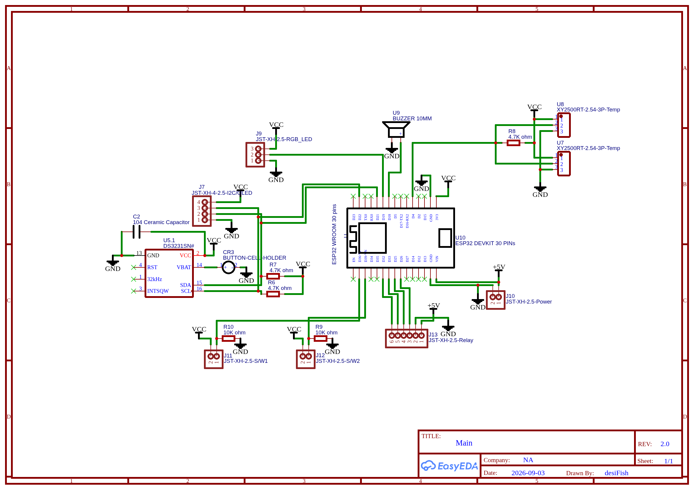
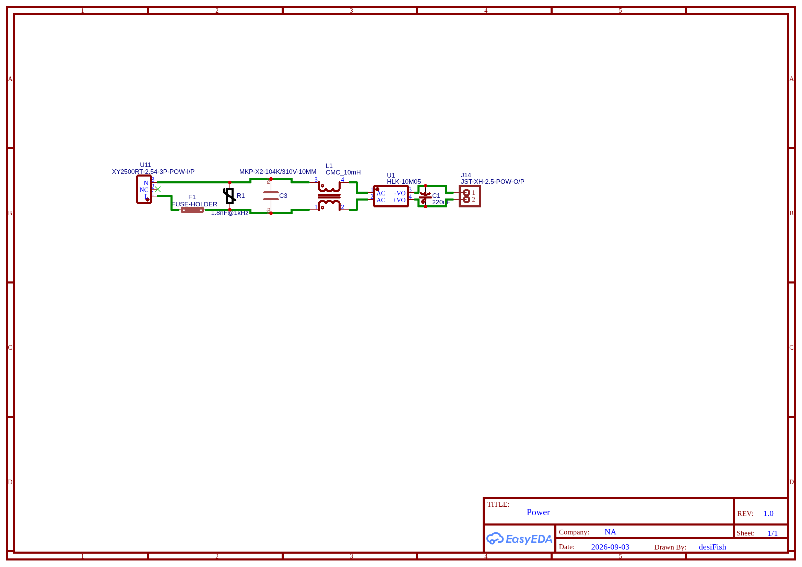

# Project_Mina 🐠

> In Sanskrit, "Mina" (मीन) represents the fish, symbolizing freedom, fluidity, and the eternal flow of life. As the twelfth and final sign of the zodiac (known as "Pisces" in Western astrology), Mina embodies adaptability and spiritual wisdom. Just as fish navigate the depths with graceful purpose, this project aims to create harmony between technology and aquatic life. The name embodies our philosophy of maintaining balance in the artificial ecosystems we create, guided by ancient wisdom yet powered by modern innovation.

> Inspired from this project, ESP8266 versions have been developed and running successfully. These are actively being developed and are simpler versions without complex sensors. Check them out:  
> - [Smart-Aquarium-V3.1](https://github.com/desiFish/Smart-Aquarium-V3.1)  
> - [Smart-Aquarium-V3.1-Lite](https://github.com/desiFish/Smart-Aquarium-V3.1-Lite)

> © 2025 desiFish. This project is protected by copyright law. All rights reserved unless explicitly stated under the GPL v3 license terms.

## Index

- [Gallery](#-gallery)
- [Safety](#-safety)
- [Project Overview](#project-overview)
- [Relay Modes](#relay-modes)
   - [Manual](#manual)
   - [Auto](#auto)
   - [Timer](#timer)
   - [Toggle](#toggle)
   - [Temperature](#temperature)
- [Hardware](#hardware)
- [Indicators and Recovery](#indicators-and-recovery)
- [Web Interface and API](#web-interface-and-api)
- [Setup and Upload](#setup-and-upload)
- [Persistence](#persistence)
- [Firmware Structure](#firmware-structure)
- [Contributing](#contributing)
- [License](#license)

## 🖼️ Gallery

<table>
<tr>
   <td align="center">
      
       Control Interface
   </td>
   <td align="center">
      
       Mobile Control Interface
    </td>
</tr>
<tr>
   <td align="center">
      
       Settings Interface
   </td>
   <td align="center">
      
       Mobile Settings Interface
   </td>
</tr>
<tr>
   <td align="center">
      
       Main Schematic
   </td>
   <td align="center">
      
       Power Schematic
    </td>
</tr>
</table>

## ⚠️ Safety

This project combines an isolated low-voltage controller with relay outputs that may switch aquarium equipment connected to mains electricity. The Power schematic shows an AC input, fuse, protection capacitor, common-mode filtering, an HLK-10M05 isolated AC/DC module, and a filtered 5 V output connector. The Main schematic distributes the low-voltage supply to the ESP32, relay interface, sensors, display, buzzer, buttons, and status LED.

**Mains voltage can cause serious injury or death.** The mains section must be built, inspected, tested, and serviced only by a suitably qualified person.

- Use an enclosure, strain relief, fuse, circuit breaker, and RCCB/RCD appropriate for the installation.
- Confirm the fuse, protection components, HLK-10M05 ratings, creepage, clearance, and enclosure are suitable for the local mains voltage.
- Keep mains wiring physically separated from the ESP32, relay signals, sensor wiring, and aquarium water.
- Provide protective earthing where required by local regulations.
- Never work on the circuit while energized or with wet hands.
- Treat the schematics as reference designs, not as a complete product-safety review.

## Project Overview

Smart Aquarium V4.0 is an ESP32-WROOM-based aquarium controller with four active-low relay channels, a responsive LittleFS web interface, local display feedback, temperature control, scheduling, and OTA firmware updates. The current firmware version `v0.5.1`.

The controller can:

- Independently enable, disable, name, and control four relay channels.
- Drive relays manually, on a clock schedule, with a countdown timer, in a repeating toggle cycle, or from a DS18B20 temperature setpoint.
- Use a DS3231 RTC for schedules and NTP for time correction.
- Monitor up to eight discovered DS18B20 sensors on one shared 1-Wire bus.
- Display the current time, Wi-Fi state, IP address, and queued fault messages on a 128x64 SH1106 OLED.
- Report faults through the web API, buzzer, and WS2812B status LED.
- Store relay and system settings across restarts using LittleFS and ESP32 Preferences.
- Start a Wi-Fi access point for first-time credential setup.
- Receive firmware updates through ElegantOTA at the `/update` page.

## Relay Modes

Each relay supports five modes. A relay must be enabled before any mode can turn its output on.

### Manual

The dashboard directly toggles the relay. Selecting Manual also stops timer control and ends an active toggle cycle.

### Auto

The relay follows an ON and OFF time in `HH:MM` format. Overnight ranges are supported; for example, ON at `22:00` and OFF at `06:00` remains active across midnight. Auto mode requires a healthy RTC.

### Timer

The dashboard starts a temporary countdown using one of the available presets: 1, 5, 10, 15, 30, or 45 minutes. When the countdown expires, the relay output is toggled and the timer becomes inactive; the selected mode remains `timer` until another mode is chosen.

### Toggle

The relay repeatedly alternates between ON and OFF using independently configured durations from 1 to 1440 minutes. The dashboard displays the current phase and remaining time.

### Temperature

The user assigns one discovered DS18B20 address and a target temperature. The controller uses a +/- 0.5 C hysteresis band: it turns on at or below target minus 0.5 C and turns off at or above target plus 0.5 C. An invalid reading forces the relay off and changes the mode to Manual. If the assigned address is not currently discovered, the firmware records an error and leaves the existing output state unchanged until the sensor becomes available again.

Temperature support can be disabled from Settings. If no sensor is found at startup, the firmware disables temperature support and records an error.

## Hardware

The Main schematic is based on an ESP32-WROOM 30-pin DevKit. The current hardware exposes four relay outputs, two active-high button inputs with pull-down resistors, two parallel DS18B20 connectors, a DS3231 RTC connector, an SH1106 OLED connector, a WS2812B connector, a buzzer, and a 5 V power input.

The relay count is configurable in the firmware at compile time. Change `NUM_RELAYS` and provide the same number of GPIO entries in `RELAY_PINS` in `Smart-Aquarium-V4.0.ino`. The firmware then creates that many `Relay` objects, registers the corresponding `/api/ledN/...` routes, includes them in polling and reset operations, and reports the value through `/api/relay-count`. The web dashboard and Settings page read that endpoint and generate their relay panels and name fields dynamically.

This is not runtime expansion: adding physical channels still requires suitable relay hardware, GPIOs, connector capacity, and safe electrical design. The supplied schematic and pin table describe the current four-relay build.

### Pin Mapping

| Function | Connection |
| --- | --- |
| Relay 1 | GPIO 32 |
| Relay 2 | GPIO 33 |
| Relay 3 | GPIO 25 |
| Relay 4 | GPIO 26 |
| DS18B20 1-Wire bus | GPIO 4 |
| WS2812B data | GPIO 19 |
| Buzzer | GPIO 18 |
| Left button | GPIO 36 |
| Right button | GPIO 39 |
| I2C SDA | GPIO 21 |
| I2C SCL | GPIO 22 |
| OLED I2C address | `0x3C` |
| RTC I2C address | `0x68` |

The two temperature connectors are wired in parallel on the same 1-Wire bus. The schematic shows a 4.7 kOhm pull-up on the data line. The RTC is a DS3231 module with a coin-cell holder and the OLED shares the I2C bus. The relay connector carries four GPIO outputs plus 5 V and ground. The RGB LED connector carries 3.3 V, data, and ground.

### Power Section

The separate Power schematic routes the AC input through a fuse, a MOV for voltage-spike protection, and a filtering network before the HLK-10M05 isolated supply. The isolated output is filtered and brought to a two-pin connector for the Main board's 5 V and ground input. The MOV is a protection component, not a substitute for correct fusing, earthing, enclosure, and overcurrent protection. Component ratings and the final mains wiring must be selected for the intended installation; the schematic does not by itself establish safe construction or isolation.

## Indicators and Recovery

The single WS2812B status LED is independent of the OLED:

- **Red:** a device error is latched.
- **Yellow:** one or both user buttons are pressed.
- **Green:** a brief low-brightness activity pulse during normal operation.
- **Blue:** factory reset is active and a restart is pending.

The WS2812B is powered from 3.3 V, as shown in the Main schematic. The buzzer alert patterns implemented by the firmware are:

- **One beep:** startup confirmation and setup completion.
- **Four beeps:** OLED initialization failed.
- **Three beeps:** OLED runtime communication failed, or a temperature read failure alarm is active. Temperature failures repeat this three-beep pattern every three seconds until the sensors recover.
- **One beep:** OLED communication was restored.

The buzzer uses 200 ms on/off timing by default; the OLED recovery alert uses a shorter 150 ms timing. Physical button input clears the latched RGB error alarm. OLED messages remain queued until a button is pressed to dismiss them. The OLED normally powers down after 30 seconds without button activity and wakes on the next button press.

The left button starts a factory reset when held for 10 seconds. A reset removes relay JSON files and erases NVS preferences, then reboots after five seconds. The Settings page also provides Reset All, Reboot, time update, and error acknowledgement actions.

## Web Interface and API

The `data/` directory is uploaded to LittleFS and contains three pages:

- `index.html` provides the relay dashboard, live state polling, mode controls, timer and toggle countdowns, schedule inputs, and temperature assignment.
- `settings.html` provides NTP and timezone configuration, relay naming, temperature support, RTC update, reboot, factory reset, and connection/error status.
- `wifimanager.html` accepts the SSID and password when the controller is in setup access-point mode.

### Firmware Updates

After the device is connected to Wi-Fi, open `http://<device-ip>/update` to use the ElegantOTA upload page. Upload only firmware images built for the correct ESP32 board and verify that the controller has stable power throughout the update. Do not start an update while other control actions or repeated polling are in progress.

### Browser Load

Use one dashboard window and one Settings window at a time. The pages poll relay state, RTC data, errors, sensor data, and connection status continuously; timer and toggle views add their own countdown requests. Several open windows or duplicated tabs multiply those requests and can slow down or temporarily overwhelm the ESP32 web server, especially during OTA updates. Avoid many tabs, aggressive auto-refresh extensions, or simultaneous bulk requests.

Important API groups include:

| Endpoint group | Purpose |
| --- | --- |
| `/api/status`, `/api/version`, `/api/relay-count` | Device status, firmware version, and relay count |
| `/api/ledN/name` | Read or change a relay name |
| `/api/ledN/system/state` | Read or change relay enabled state |
| `/api/ledN/mode` | Read or change the selected mode |
| `/api/ledN/toggle` | Manually toggle a relay |
| `/api/ledN/schedule` | Read or set an Auto schedule |
| `/api/ledN/timer` and `/timer/state` | Start, stop, and inspect a timer |
| `/api/ledN/toggle-mode` and `/toggle-mode/state` | Start, stop, and inspect a toggle cycle |
| `/api/ledN/temperature` | Read or set temperature control |
| `/api/sensors` | List discovered sensors and readings |
| `/api/rtctime`, `/api/time/update`, `/api/time-settings` | Read, update, and configure RTC time |
| `/api/system/config` | Enable or disable temperature support |
| `/api/error` and `/api/error/ack` | Read and acknowledge device errors |
| `/api/reboot`, `/api/reset` | Schedule a reboot or factory reset |

## Setup and Upload

### Requirements

- ESP32-WROOM-class DevKit compatible with the pin mapping above.
- Arduino IDE with the ESP32 board package, or an equivalent Arduino build environment.
- A LittleFS upload tool for the contents of `data/`.
- DS3231 RTC, SH1106 OLED, DS18B20 sensors, WS2812B LED, buzzer, buttons, relay hardware, and a suitable isolated 5 V supply.

### Libraries

Install these libraries before compiling:

- [ESPAsyncWebServer](https://github.com/ESP32Async/ESPAsyncWebServer)
- [AsyncTCP](https://github.com/ESP32Async/AsyncTCP)
- [ElegantOTA](https://github.com/ayushsharma82/ElegantOTA)
- [ArduinoJson](https://arduinojson.org/)
- [RTClib](https://github.com/adafruit/RTClib)
- [NTPClient](https://github.com/arduino-libraries/NTPClient)
- [DallasTemperature](https://github.com/milesburton/Arduino-Temperature-Control-Library)
- [OneWire](https://github.com/PaulStoffregen/OneWire)
- [Adafruit GFX Library](https://github.com/adafruit/Adafruit-GFX-Library)
- [Adafruit SH110X](https://github.com/adafruit/Adafruit_SH110X)
- [Adafruit NeoPixel](https://github.com/adafruit/Adafruit_NeoPixel)

`WiFi`, `Wire`, `SPI`, `Preferences`, `LittleFS`, and `nvs_flash` are supplied by the ESP32 Arduino core.

### First Upload

1. Open `Smart-Aquarium-V4.0.ino` in Arduino IDE. For a different channel count, update `NUM_RELAYS` and the matching `RELAY_PINS` array first.
2. Select the ESP32 board variant and serial port.
3. Compile and upload the firmware.
4. Upload the complete `data/` directory to the device's LittleFS partition.
5. Restart the controller.

If no Wi-Fi credentials are stored, the controller creates the open access point `Smart-Aquarium` and serves the Wi-Fi Manager page. Connect to that network, open `192.168.4.1`, submit the network SSID and password, and wait for the automatic restart. With saved credentials, the controller attempts station-mode connection for up to 15 seconds. The normal dashboard is available at the device's assigned IP address.

## Persistence

- Relay configuration is stored as `/config/relayN.json` on LittleFS, with one file for each configured relay.
- Relay names, enabled state, mode, schedule, toggle settings, sensor assignment, and temperature targets are persisted where applicable.
- Wi-Fi credentials are stored in the `wifi` Preferences namespace.
- NTP server, custom server, timezone offset, and last update day are stored in the `time` namespace.
- The temperature-support setting is stored in the `system` namespace.
- `/api/reset` and the 10-second left-button hold erase the relay files and NVS preferences before rebooting.

## Firmware Structure

The firmware splits work between the Arduino loop and a FreeRTOS task pinned to core 0:

- `loop2()` polls the buttons, updates timer and toggle state machines, checks I2C health, reads DS18B20 sensors, and evaluates schedules and temperature control.
- `loop()` services ElegantOTA, renders the OLED, emits temperature-fault alarms, performs periodic RTC maintenance, and executes scheduled restarts.
- The `Relay` class owns per-channel state, configuration persistence, GPIO polarity, scheduling, timers, toggle cycles, and temperature hysteresis.

Polling intervals are approximately 10 ms for task yielding, 2 seconds for sensor and schedule work, 5 seconds for RTC/OLED health checks, and 1 hour for automatic RTC update eligibility. The relay loops use `NUM_RELAYS`, so the same firmware structure scales to the configured channel count.

## Contributing

Issues, hardware feedback, documentation fixes, and pull requests are welcome. Include the board variant, firmware version, wiring changes, and clear reproduction steps when reporting a problem.

## License

This project is licensed under the GNU General Public License v3.0. See [LICENSE](LICENSE) for the full license text.

### What the GPLv3 Allows

Under GPLv3, you may use the software for any purpose, study how it works, modify it, and redistribute original or modified copies. You may distribute compiled firmware, but you must follow the GPLv3 source and license obligations, including providing the corresponding source code and preserving copyright and license notices where required. Modified versions distributed to others must remain under GPLv3, and recipients must receive the same freedoms.

You may sell copies or charge for support and services. You may not remove the GPLv3 terms, add restrictions that take away the recipient's freedoms, claim the author's work as your own, or distribute a modified binary without meeting the applicable source-code and notice requirements. The hardware schematics and safety information do not make a mains installation safe or grant permission to use trademarks, third-party libraries, or hardware designs beyond their own licenses.

Copyright (C) 2025 desiFish